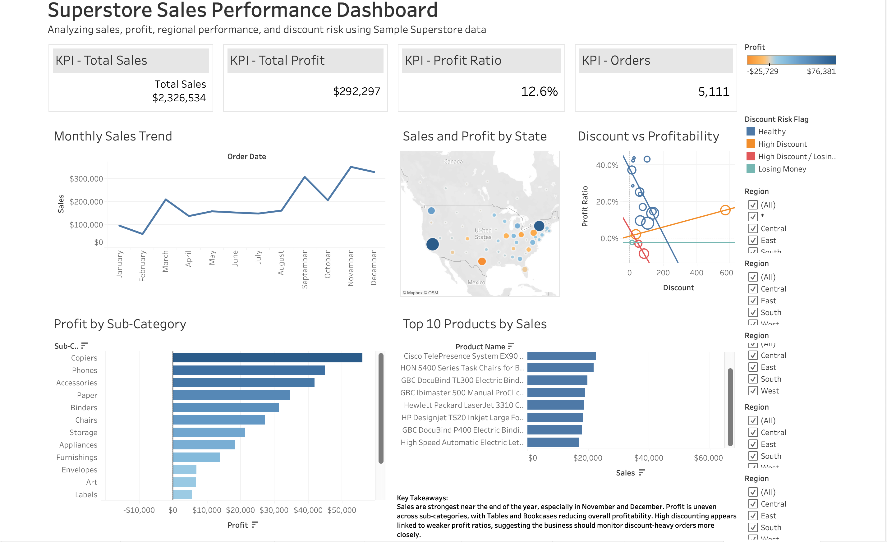

# Superstore Sales Performance Dashboard

## Project Overview

This project analyzes sales, profit, regional performance, product performance, and discount risk using the Sample Superstore dataset. The dashboard was built in Tableau to identify business trends, profitability issues, and areas where discounting may be hurting performance.

## Dashboard Preview



## Dashboard Demo

A short screen recording of the dashboard is included below:

[Watch the Dashboard Demo](dashboard_demo.mp4)

## Business Questions

This dashboard answers the following questions:

1. How are sales trending over time?
2. Which states generate the most sales and profit?
3. Which product sub-categories are most and least profitable?
4. How does discounting relate to profitability?
5. What areas should the business monitor to improve performance?

## Tools Used

- Tableau
- Excel
- GitHub

## Dashboard Features

- KPI cards for Total Sales, Total Profit, Profit Ratio, and Orders
- Monthly sales trend analysis
- Sales and profit map by state
- Profit by sub-category analysis
- Discount vs profitability analysis
- Region filter for interactive analysis

## Key Insights

Sales are strongest near the end of the year, especially in November and December, suggesting strong seasonal demand.

Profitability is uneven across product sub-categories. Some sub-categories generate strong profit, while others reduce overall profitability.

Discounting appears connected to weaker profit ratios. Orders with higher discounts should be monitored more closely because excessive discounting can reduce or eliminate profit.

Regional performance varies across the United States, showing that sales and profit are not evenly distributed across states.

## Files in This Repository

```text
Superstore_Sales_Performance_Dashboard.twbx
data/Sample_Superstore.xlsx
images/dashboard_full_view.png
videos/dashboard_demo.mov
